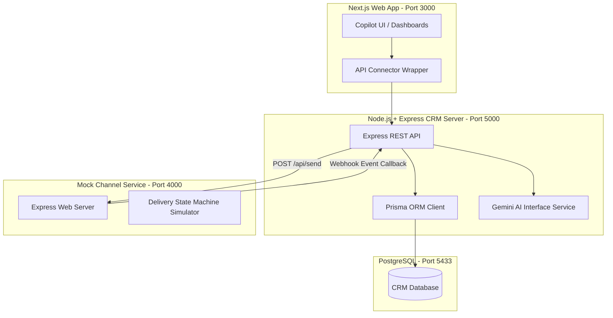

# Xeno AI Campaign Copilot

**Xeno AI Campaign Copilot** is a next-generation, AI-native CRM and marketing campaign management platform. Instead of managing traditional SQL/CSV databases and manual queries, marketers enter their goals in plain natural language (e.g., *"Re-engage customers who have not bought in 60 days"*), and the AI automatically designs the segments, suggests channels, writes personalized templates, drafts campaigns, and monitors delivery status events in real-time.

---

## 🏗️ Architecture

The platform is designed as a decoupled microservices architecture connecting a rich frontend dashboard, a CRM analytical engine, and a simulated webhook channel pipeline.



---

## 🛠️ Tech Stack

- **Frontend**: Next.js 15, TypeScript, Tailwind CSS, Lucide icons, Recharts.
- **Backend Service**: Node.js, Express, TypeScript, Prisma ORM, PostgreSQL.
- **AI Integration**: Gemini 1.5 Flash API (utilizing structured JSON schemas).
- **Outreach Service**: Mock Channel Service (Express callback webhook engine).

---

## 🚀 Quick Start Guide

Prerequisites: Ensure **Node.js** (v20+) and **npm** or **pnpm** are installed.

### Step 1: Start PostgreSQL Database
We configured PostgreSQL to run on port `5433` (to avoid conflicts with any pre-existing system-wide services on port `5432`).
Ensure Homebrew PostgreSQL is active:
```bash
brew services start postgresql@18
# Verify database exists:
createdb -h localhost -p 5433 xeno_crm
```

### Step 2: Configure & Start CRM Backend
1. Open the `/backend` directory.
2. Edit the `.env` file and input your `GEMINI_API_KEY` (leave empty to use the local smart mock NLP parser):
   ```env
   PORT=5005
   DATABASE_URL="postgresql://nirajnillawar@localhost:5433/xeno_crm?schema=public"
   GEMINI_API_KEY="YOUR_GEMINI_API_KEY"
   CHANNEL_SERVICE_URL="http://localhost:4000"
   CRM_BACKEND_URL="http://localhost:5005"
   ```
3. Run migrations and seed data (creates 120 customers and 640 order records in Rupees):
   ```bash
   cd backend
   npm install
   npx prisma migrate dev --name init
   npm run prisma:seed
   ```
4. Start the backend:
   ```bash
   npm run dev
   ```

### Step 3: Start the Channel Simulator Service
The Channel Service receives message dispatches and posts async webhooks simulating message delivery (`DELIVERED`, `OPENED`, `CLICKED`, `FAILED`).
```bash
cd channel-service
npm install
npm run dev
```

### Step 4: Start the Next.js Frontend
```bash
cd frontend
npm install
npm run dev
```
Open **[http://localhost:3000](http://localhost:3000)** in your browser!

---

## 🐳 Docker Compose Deployment (Recommended)

To run the entire ecosystem (including a dedicated PostgreSQL instance, the Express CRM backend, the mock channel pipeline, and the Next.js frontend app) in isolated Docker containers:

1. Ensure **Docker** and **Docker Compose** are installed and running.
2. Spin up the containers (this will build the Dockerfiles, initialize database schemas, apply seed records, and link services):
   ```bash
   docker-compose up --build -d
   ```
3. Wait 10-15 seconds for compilation and database hydration to finish.
4. Access the web app at **[http://localhost:3000](http://localhost:3000)**.
5. To check container logs or shut down the ecosystem:
   ```bash
   docker-compose logs -f
   docker-compose down -v
   ```

---

## 👤 Core Marketing Journey Workflow

1. **AI Copilot Desk**: Type a natural language prompt (e.g. *"Target VIP customers"*).
2. **Review Drafts**: The interactive previewer displays matching customers (dry-run query), recommended channel (Email, SMS, or WhatsApp), and the AI-written copy template.
3. **Launch**: Click **"Launch Campaign"**. The backend creates the segment, structures the communications, hydrates templates (replacing `{name}` values), and dispatches them.
4. **Live Events Polling**: The frontend begins polling the webhook endpoint. Within seconds, you will observe progress bars and funnel drop-off charts updates in real-time as the Channel Service publishes webhook responses back to the CRM!
